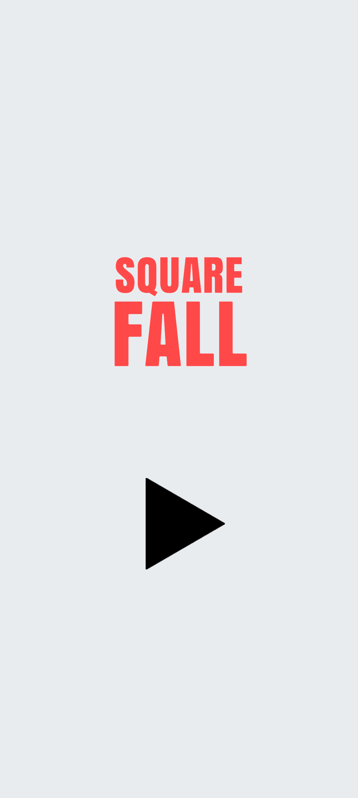
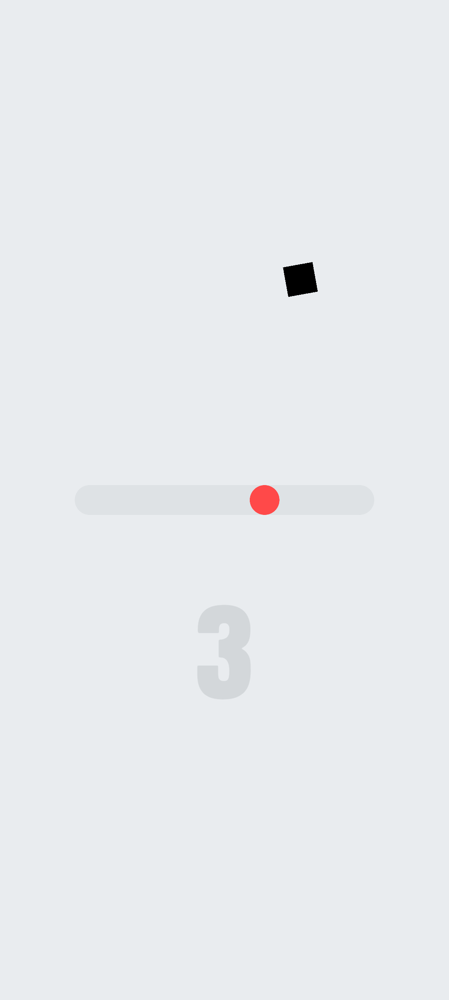
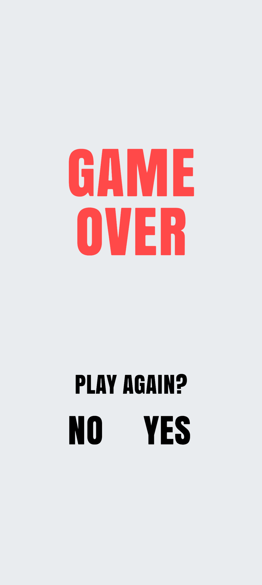

### SquareFall
This is one of my personal portfolio projects, the purpose of which consists of practicing development with Unity and presenting it as a piece of work for interview.

The game is based on the [video at this link](https://www.pinterest.com/pin/664492120060142757/), and restores as much of the core gameplay as possible based on the screenshots seen.

This project is not for commercial purposes.

  